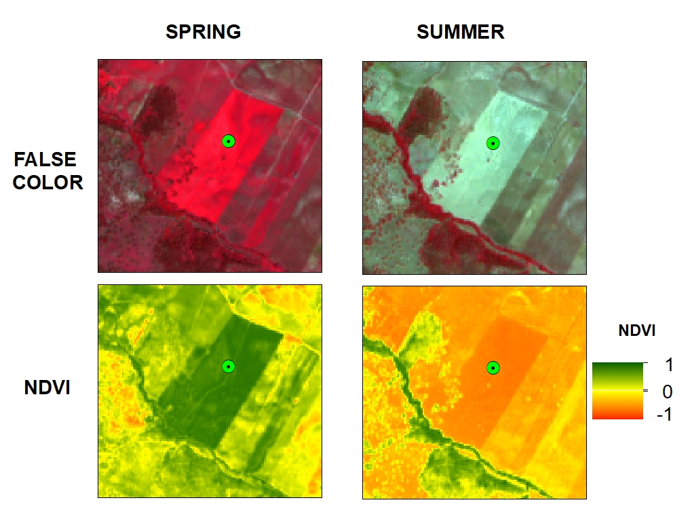
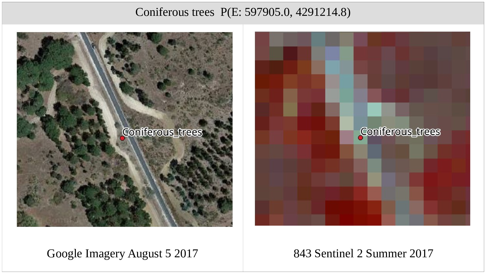
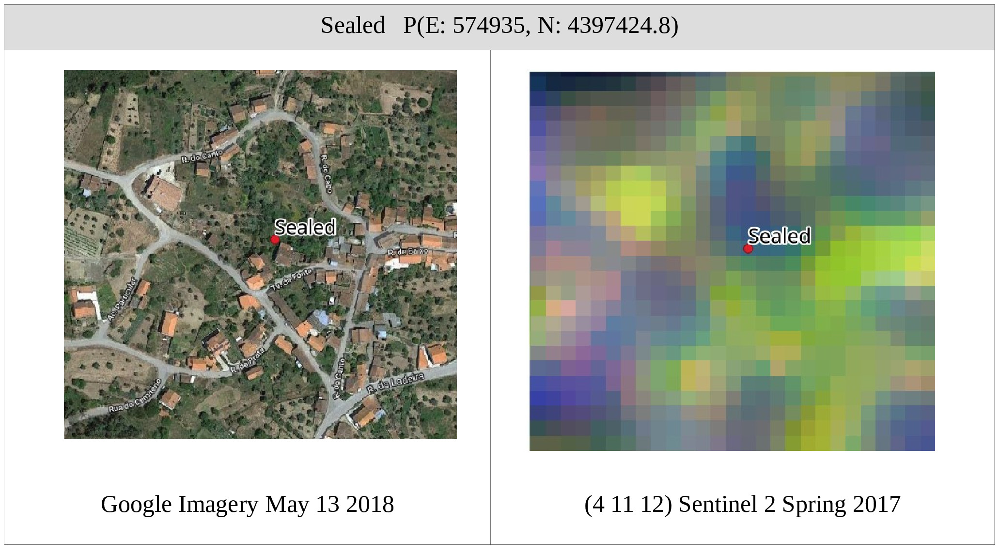
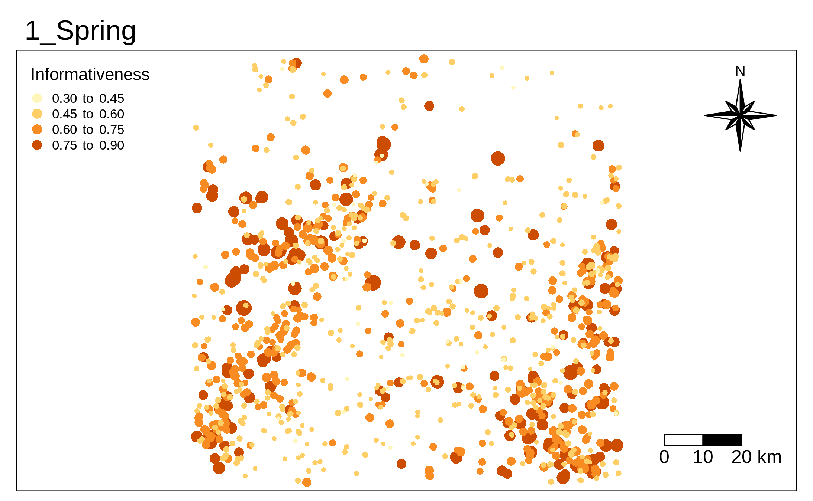

<style>
body {
text-align: justify}
</style>

```{r setup, include=FALSE}
knitr::opts_chunk$set(echo = TRUE)
library(knitr)
library(kableExtra)
```

The attempt of this document is to show the routines in R for the visualization of the main results of this thesis using a workflow based in supervised classification in synergy with training data extracted from an old map. Details in the results can be found directly in the main report. To implement this we used primarly packages such as **ggplot2**, **raster**, **stars**, **tmap** and **sf**.

# Introduction

Image processing in synergy with remote sensing is indeed automation of the production of LULC mapping, where the level of human intervention may vary depending on the schema of classification. The better experience with supervised classification over large areas and under high dimensionality, but with the limitations of the need of updated an representative training data that is manually collected, let us to question if the integration of training data extracted from an all map can lead to fully automate the workflow of classification as well as keeping high-quality results.

To answer that we proposed to use supervised classification that uses training data extracted from an old ma developed in 2015 to classify singular and Best available pixel composites of 2017 using simple nomenclature.

# Data

The proposed classification procedures are tested on Sentinel-2 images acquired in 2017. The training data is extracted from COS map of Portugal 2015 (National LULC map of Portugal), whereas the validation corresponds to two datasets, one out-of-date that corresponds to a fraction of the dataset 2015 and another constructed using satellite image interpretation in 2017. 

## Images 2017

We implemented the methodology using 10 images of 2017; one per month. We also used the Sent2Cor tool to perform the atmospheric and radiometric correction of the images.The following image shows the normalization of 4 bands of a tile collected in june 29 of 2017.

```{r , message=FALSE}
library(stars)
library(raster)
folders_path = 'D:\\TESISMASTER\\IMAGES\\TO_PROCESS_10m\\Prediction\\STATIC\\IM_20170729'
read_raster = function(x){
  y = raster::raster(paste0(folders_path,"/",x))
  names(y) = "IM"
  return(y)
}
list_raster = lapply(list.files(folders_path)[c(1,4,10,11)],read_raster)
rasters_stack = stack(list_raster)
names(rasters_stack)  = c("BLUE","B05","B8A","NDVI")

#converting to stars object
rasters_stars = st_as_stars(rasters_stack)
plot(rasters_stars)
```


## Cos map 2015

COS map is a national product describing LULC of Portugal with a MMU of 1 Ha and produced using aerial image interpretation. COS map has 5 levels and the level with more detail comprises 48 different classes. DGT is the institute in charge of producing this map and has available four versions (1995, 2007,2010 173 Data and study area and 2015).


## Training data

Using Cos map as a reference, we performed an equalized random sampling done over the study area to extract the labels. For the first dataset composed of nine classes, we selected 1000 samples per class for the categories of Shrubs, Coniferous trees, Eucalyptus trees, Holm and cork trees, Herbaceous, no vegetated areas, sealed surface, water surfaces, and wetlands. Instead, the second dataset composed of six classes, it comprised 1000 samples per class samples for the categories of Woody, Herbaceous, no vegetated areas, sealed surface, water surfaces, and wetlands. In this context, after the atmospheric and radiometric correction of the imagery, we extracted the spectral information per sample using imagery that came from 2015 and 2017.

```{r , message=FALSE, warning= FALSE, message= FALSE}
#importing shapefile
library(sf)
library(tmap)
path_training = 'D:\\TESISMASTER\\VECTOR\\Raw_trainingdata\\training_samples8.shp'
path_studyarea = 'D:\\TESISMASTER\\VECTOR\\CartoBase\\StudyArea.shp'
path_portugal_limit = 'D:\\TESISMASTER\\VECTOR\\CartoBase\\Limit_Portugal.shp'

sampling = sf::read_sf(path_training)
study_area = sf::read_sf(path_studyarea)
portugal = sf::read_sf(path_portugal_limit)
pal10 <- c("#AAFF00", "#FF0000","#267300" , "#FFFF00", "#A80000", "#8505CA","#000000" , "#002673","#0070FF")
tmap_mode("view")
map_data <-
  tm_shape(sampling) + 
      tmap::tm_dots('CLASS_NAME', palette = pal10) +
  tm_shape(study_area) + 
      tmap::tm_borders(col = "red",lwd=2) +
  tm_shape(portugal) + 
      tmap::tm_borders(col = "blue",lwd=3) +
  tm_layout(basemaps = c('OpenStreetMap'),legend.text.size = 1)
map_data
```


# Baseline

Generally, classification accuracy depends on multiple factors, where the nature of the training samples, the number of features (bands and ancillary data), the number of classes to be discriminated, the spatial resolution of the images and the properties of the classifier are the most important. From this angle, we set out the evaluation of the accuracy of the classification influenced by the previous factors for one image in 2015 in order to use it as a baseline to judge the results over 2017.

# Results with images 2015

The next figure shows a comparison of OA in the classifications of one image on July 25 of 2015 using two different number of classes and two different number of bands(features). On the one hand, from the number of bands, we evaluated the adding value in the OA after including ancillary data in addition to the spectral in formation that came from Sentinel 2. The three additional features corresponded to NDVI, DEM, and Slope. The addition implied a significant increase in accuracy for the discrimination of classes in both dataset of six and nine classes; 5.0 scores and 3.0 scores respectively. On the other hand, the predictive power of RF increased after merging shrubs and trees variability in only one class called Woody. Therefore, the implementation of updated reference data extracted from COS map in a supervised classification of one image in July 2015 using 13 bands resulted in accuracies of 0.61 and 0.73 for the datasets of six and nine classes respectively.

```{r }
library(ggplot2)
file_baseline = 'D:\\TESISMASTER\\csv\\Results\\Validation_models\\BaseLine.csv'
#reading file
baseline = read.csv(file_baseline  , sep = ";",header = T,dec = ',')
#text
baseline$Features = as.factor(baseline$Features)
tex_comparison_baseline = aggregate(.~Classes + Features , baseline, median)
tex_comparison_baseline$Accuracy = round(tex_comparison_baseline$Accuracy,2)
#ggplot
P1<-ggplot(data =baseline, aes(x=Features, y=Accuracy, fill = Classes, colour = Classes)) + 
  theme(axis.text.x = element_text(angle = 0, hjust = 1, size= 13),axis.text.y = element_text(angle = 0, hjust = 1, size= 14),
        legend.position="bottom", legend.text=element_text(size=14)) +
  geom_boxplot() + facet_grid(.~ Classes) +
  theme(strip.text.x = element_text(size=17,
                                      face="bold.italic"),
          strip.text.y = element_text(angle = 0,size=14,
                                      face="bold.italic"),
         axis.title.y = element_text(size=14, face="bold"),
         axis.title.x = element_text(size=14, face="bold")
        )+ xlab("Number of Features") +
   geom_text(data = tex_comparison_baseline, aes(x=Features, y=Accuracy*1.06 ,label = as.character(Accuracy)),size=4) + ylim(0, 1) 
print(P1)
```


# Results with images 2017

The following Figure shows a general evaluation of the classification of images in 2017 using as reference the training data selected from COS map 2015; classification per image considered a careful sensitive analysis of the parameters of the classifiers. In summary, the implementation of SVM with a RBF kernel outperformed the results obtained with RF over all the imagery of 2017 with average differences of 2 scores.

```{r }
library(ggplot2)
file_comparision_models = 'D:\\TESISMASTER\\csv\\Results\\Validation_models\\Comparison_performance_classifiers_singledate.csv'
#reading file
comparision_models  = read.csv(file_comparision_models  , sep = ";",header = T, dec = ',')
#ggplot
tex_comparison = aggregate(.~Classes + Model + Time , comparision_models, median)
tex_comparison$Accuracy = round(tex_comparison$Accuracy ,2)
comparision_models$Time = factor(comparision_models$Time, levels = c("Jan.15","Apr.05","May.25","Jun.14","Jul.29","Aug.13","Sep.12","Oct.12","Nov.16","Dec.16") ) 

p1 <- ggplot(data =comparision_models , aes(x=Time, y=Accuracy ,fill = Model, colour = Model)) + 
    theme(axis.text.x = element_text(angle = 90, hjust = 1, size= 13),axis.text.y = element_text(angle = 0, hjust = 1, size= 14),
        legend.position="bottom", legend.text=element_text(size=14)) +
  geom_boxplot() + ylim(0, 1) + facet_grid(rows = vars(Classes)) +
  theme(strip.text.x = element_text(size=17,
                                      face="bold.italic"),
          strip.text.y = element_text(angle = 90,size=14,
                                      face="bold.italic"),
         axis.title.y = element_text(size=14, face="bold"),
         axis.title.x = element_text(size=14, face="bold")) +
  geom_text(data=tex_comparison, aes(x=Time, y=Accuracy*1.1 ,label = as.character(Accuracy)),
            position=position_dodge(width=0.8),size=4) +
  xlab("Singular Images 2017")
print(p1)
```

#comparison scene-based and pixel-based Composites

The production of BAP composites raised the curiosity for comparison in the classification performance between single images and composites. In the case of classification of a dataset with six categories, Figure 5.6 shows the classification evaluation using OA for the best singular images per season vs. the BAP composites. The results showed equivalent OA for all the images based in the same range of variation of the OA after cross-validation

```{r }
library(ggplot2)
file_comparision_comp_static = 'D:\\TESISMASTER\\csv\\Results\\Validation_models\\Comparison_composites_singledate.csv'
#reading file
comparision_comp_static = read.csv(file_comparision_comp_static  , sep = ";",header = T,dec = ',')
#Quering class
comparision_comp_static_query = comparision_comp_static[comparision_comp_static$Classes==6,-1]
#organizing factors
comparision_comp_static_query$Date= factor(comparision_comp_static_query$Date, levels = c("Apr.05","BPA.Spr","Jul.29","BPA.Sum","Sep.12","BPA.Aut","Dec.16", "BPA.Win"))
comparision_comp_static_query$Season = factor(comparision_comp_static_query$Season, levels = c("Spring","Summer","Autumn","Winter"))
tex_comparison = aggregate(.~Model + Season + Date , comparision_comp_static_query, median)
tex_comparison$Accuracy = round(tex_comparison$Accuracy,2)
#ggplot
PL<-ggplot(data =comparision_comp_static_query, aes(x=Date, y=Accuracy, fill = Season, colour= Season)) + 
  theme(axis.text.x = element_text(angle = 90, hjust = 1, size= 13),axis.text.y = element_text(angle = 0, hjust = 1, size= 14),
        legend.position="bottom", legend.text=element_text(size=14)) +
  geom_boxplot() + facet_grid(.~ Model) +
  theme(strip.text.x = element_text(size=17,
                                      face="bold.italic"),
          strip.text.y = element_text(angle = 0,size=14,
                                      face="bold.italic"),
         axis.title.y = element_text(size=14, face="bold"),
         axis.title.x = element_text(size=14, face="bold")
        )+ xlab("Singular Image vs BPA") +
   geom_text(data=tex_comparison, aes(x=Date, y=Accuracy*1.06,fill = Season ,label = as.character(Accuracy)),size=4) + ylim(0.4, 1) 
print(PL)
```


#Refinement of traning data


Predefined labels by the old maps can be contributive to the classification of one recent image or not depending on different scenarios in which the data is extracted. For example, point random extraction can intersect complexities of a wide diversity of classes that were simplified in one class in the map or intersect outdated labels. Some examples are the following:


##Phenology

The presence of herbaceous periodic questioned if the dynamic for phenology could impact notably the number of right samples representing herbaceous over the year



## Spatial continuity of the land cover map

Point random extraction can intersect complexities of a wide diversity of classes that were simplified in one class in the map.






This scenarios questioned if quality control over the training data can result in better accuracy


#Refinament procedure base on margins of NDVI signals

This method consists of taking out samples, from a dispersion of NDVI values per image and per class, the NDVI values beyond 1.5 times the IQR. The next graphic shows the OA of the classification with and without implementation of this kind of refinement.

```{r }
library(ggplot2)
file_comparision_ndvi = 'D:\\TESISMASTER\\csv\\Results\\Validation_models\\Comparison_performance_ndv_cleaning.csv'
#reading file
comparision_ndvi  = read.csv(file_comparision_ndvi  , sep = ";",header = T,dec = ',')
comparision_ndvi_query = comparision_ndvi[comparision_ndvi$Type != 'Validation',]
comparision_ndvi_query$Time = factor(comparision_ndvi_query$Time, levels = c("Jan.15","Apr.05","May.25","Jun.14","Jul.29","Aug.13","Sep.12","Oct.12","Nov.16","Dec.16") ) 
#text
tex_comparison = aggregate(.~Type + Status + Time , comparision_ndvi_query, median)
tex_comparison$Accuracy = round(tex_comparison$Accuracy,2) 
#tex_comparison$position = ifelse(tex_comparison$Status == 'Raw data',tex_comparison$Accuracy*1.08,
#                                 tex_comparison$Accuracy*0.92)

#ggplot
p1 <- ggplot(data =comparision_ndvi_query, aes(x=Time, y=Accuracy ,fill = Status, colour = Status)) + 
theme(axis.text.x = element_text(angle = 90, hjust = 1, size= 13),axis.text.y = element_text(angle = 0, hjust = 1, size= 14),
        legend.position="bottom", legend.text=element_text(size=14)) +
  geom_boxplot() + facet_grid(rows=vars(Type)) +
  theme(strip.text.x = element_text(size=17,
                                      face="bold.italic"),
          strip.text.y = element_text(angle = 0,size=14,
                                      face="bold.italic"),
         axis.title.y = element_text(size=14, face="bold"),
         axis.title.x = element_text(size=14, face="bold")
        )+ xlab("Singular Image") +
   geom_text(data=tex_comparison, aes(x=Time, y=Accuracy*1.15,fill = Status ,label = as.character(Accuracy)),position=position_dodge(width=0.8),size=3.5) + ylim(0, 1) 
print(p1)
```

The classification was performed using SVM and using the two versions of test sets; TA that corresponds to a fractional part of the traning data COS 2015, and TB that correspond to an updated test for an image in July 29 of 2017. Based on comparisons of OA, the low OA in the classification over the year led to establishing that the first strategy of a cleaning preprocessing was not viable. The reason for this scenario may obey to two reasons. The first one may correspond to issues in classification due to unbalanced data. As we saw in methodology, the cleaning preprocessing implied a reduction in the number of samples for vegetation, especially during summer, and therefore possible not enough representation of them. Although the impact of unbalanced data is high in Summer, in Spring the reduction of erroneous labels was meager. However, regardless of whether the impact was low in Spring, a classification without filtering continued being better. That result allowed us to give an additional interpretation of the low performance of the strategy, that is, loss of generalization.

# Batch learning procedure

The second strategy for removing possible anomaly data hindering the results of the classification was based on iterative learning procedure. That is, before the learning step, all the train set (80%) is subject to a quality evaluation in order to define the level of contribution of each point in the classification. Using multiple splits of the training dataset (55% train, 25% validation), we recreated multiple models in order to classify itself. After that, we evaluated the level of uncertainty in every prediction using the measurement of information entropy. If a point was informative for the classification, that is, a point correctly predicted over different splits, then the point depicted low entropies values. 

## Uncertainty map

After entropie calculations, we normalized and inverted the entropies values in order to define a score of informativeness per point. As lower the score, the larger the chance of the point to be removed from the training for a specific iteration. The next graphci shows a the uncertainy in predictions for herbaceus vegetation. The size of the points may vary depending on how informative is the sample for the classification of a particular image. Here, four examples we show using as reference the spectral information extracted from BAP composites per seasons.  

```{r , echo=FALSE}
folder_uncertainty = 'D:\\TESISMASTER\\VECTOR\\Training_data_composites_max_ndvi_ST'
#calling shapefiles with the uncertainty attribute. This shapefiles are located in different folders depending the date
func_read_shp_uncertainty = function(x){
  path = paste0(folder_uncertainty,"\\",x,"\\",'training_samples8_rf_w.shp')
  df_shape = sf::read_sf(path)
  df_shape_weights =  df_shape[df_shape$CLASS_NAME == "Herbaceous","weights"]
  df_shape_weights$time = x
  return(df_shape_weights)
}
list_dfshape_uncertainty = lapply(list.files(folder_uncertainty),func_read_shp_uncertainty)

df_uncertainty = do.call("rbind", list_dfshape_uncertainty)
df_uncertainty$size = exp(df_uncertainty$weights*5)*0.01

#plot
library(ggplot2)
library(magick)
map_uncertainty <-
  tm_shape(df_uncertainty) +
    tmap::tm_symbols(size = 'size', col = 'weights', shape = 16,
                     breaks = c(seq(0.3, 1, by=0.15)),
                     legend.size.show = FALSE,
                     title.col = "Informativeness", 
                     legend.format = list(text.align="right", text.to.columns = TRUE)) +
  tm_facets(along = "time") +
  tm_compass(type = "8star", position = c("right", "top")) +
  tm_scale_bar(breaks = c(0, 10, 20), size = 1, position = c("right", "bottom"))
map_uncertainty 
#NO RUN  
#tmap_animation(map_uncertainty, filename="Herbaceouspresentation.gif", delay=300)
```




##Classification results

Each iteration removed 2.5% of points from the train set, so that, we repeated the process of calculating informativeness and took out points up to the specific definition of points in the train set led to stop a possible increase in the overall accuracy and reduce the predictive power of the classifier. Next Figure shows the implementation of the iterative learning procedure for the refinement of training data using the datasets with 6 and 9 classes in one image of July 29 of 2017. It shows in x-axis from left to right the percentage of
data removed according with their level of informativeness and in the y-axis their correspond OA for validation (blue), TA(red) and TB(green). The box-plot are a demonstration of the stability of the results of classifications under different number of observations of the training data. While the results of the cross-validation (blue margin) increased after every iteration since the model was validated using less noisy data, the OA of both test datasets kept constant over a specific range of reduction of samples. After a reduction of 20% of samples, we could appreciate that the classifier started losing the ability to generalize and predict the test datasets accurately.

```{r , warning=FALSE}
#data frame with the results without filter
library(ggplot2)
file_evaluation_active_learning = 'D:\\TESISMASTER\\csv\\Results\\Validation_models\\Evaluation_active_learning_OA.csv'
#reading file
evaluation_active_learning  = read.csv(file_evaluation_active_learning  , sep = ";",header = T, dec = ",")
#quering file for certain time
query_evaluation_active_learning  = evaluation_active_learning[evaluation_active_learning$Classes == "6_classes"  & evaluation_active_learning$Noise == 0 & evaluation_active_learning$Date == "IM20170729",c(4:6)]
#factor percentage
query_evaluation_active_learning$Iter = as.factor(query_evaluation_active_learning$Iter*100)
#agregating results
df_oa_median = aggregate(.~Iter + Type, query_evaluation_active_learning, median)
qu25 = function(x)quantile(x)[2]
qu75 = function(x)quantile(x)[4]
df_oa_min = aggregate(.~Iter + Type , query_evaluation_active_learning, qu25 )
df_oa_max = aggregate(.~Iter + Type , query_evaluation_active_learning, qu75 )
df_total = cbind(df_oa_median,df_oa_min$Accuracy,df_oa_max$Accuracy)
colnames(df_total) = c("Iter","Type","Accuracy","Min","Max")
#text
df_total_text = df_total[df_total$Iter %in% c(0,10,20,30,40,50,59),]
#ggplot
p <- ggplot(df_total, aes(x=as.numeric(Iter), y=Accuracy, ymin=Min, ymax=Max)) +
  geom_ribbon(aes(fill=Type), alpha=0.8) +
  geom_line(aes(color=Type)) +
  theme(axis.text.x = element_text(angle = 90, hjust = 1, size= 13),axis.text.y = element_text(angle = 90, hjust = 1, size= 13),axis.title.x = element_text(size=13, face="bold"),
        axis.title.y = element_text(size=13, face="bold"),
        legend.position="bottom", legend.text=element_text(size=13)) +
   geom_point(data=df_total_text , aes(x=as.numeric(Iter), y=Accuracy, fill=Type, colour = Type),  
             shape="+", size=4)+
  geom_text(data = df_total_text, aes(x=as.numeric(Iter), y=Accuracy*1.04 ,label = as.character( round(Accuracy,2))), col='black', size=4) +
   scale_x_continuous(breaks=seq(0,60,10)) + 
  xlab("Informativeness") + ylim(0.4, 1) 
print(p)
```


### Accuracy per class

Further inspection of the methodology performance was done over the accuracies per class. Next Figure shows the producer accuracy for the nine classes of dataset one using as reference the image of July 29 of 2017 and TB. The number over each line correspond to the accuracy per class at a specific percentage of data removed. For example, the class water that on average had a producer accuracy of 0.87 benefited in 3 scores with a reduction of 15% of samples. However, this did not happen with the class sealed, since a reduction of 8% of the lowest informative samples for this class ended up decreasing the predictive power of the model to classify it. In general, classes with vegetation are highly impacted in number for the refinement procedure; it should be noted, the predictive power for classes with vegetation is affected negatively y the methodology after removing 20% of the total information.

```{r }
library(ggplot2)
file_comparision_perclass = 'D:\\TESISMASTER\\csv\\Results\\Validation_models\\Evaluation_active_learning_perclass.csv'
file_position_text = 'D:\\TESISMASTER\\csv\\Results\\Validation_models\\Evaluation_active_learning_perclass_text.csv'
#reading file
comparision_perclass  = read.csv(file_comparision_perclass  , sep = ";",header = T, dec = ",")
comparision_perclass_query = comparision_perclass[comparision_perclass$Classes == '9_classes' &
                                                  comparision_perclass$Noise == 0 &
                                                  comparision_perclass$Date == 'IM20170729' &
                                                  comparision_perclass$Type == 'TA',c(5:7)]  
df_median = aggregate(.~Iter + Class, comparision_perclass_query, median)
#text
df_median$Iter = df_median$Iter*100

df_median_text = read.csv(file_position_text, sep = ";",header = T, dec = ",")

#df_median_text = df_median[df_median$Iter %in% c(0,10,20,30,40,49),]
#ggplot
pal10 <- c("#C133FF", "#556E19", "#33A02C","#B2DF8A", "#999999", "#FDBF6F", "#FF0000", "#1F78B4", "#A6CEE3")
p2<-ggplot(data = df_median, aes(x=Iter, y=Accuracy,group=Class ,colour = Class )) +
  geom_line(stat="identity",size=1.3) +
    theme(axis.text.x = element_text(angle = 0, hjust = 1, size= 13),axis.text.y = element_text(angle = 0, hjust = 1, size= 15),
        legend.position="bottom", legend.text=element_text(size=14))+
  scale_colour_manual(values=pal10) +
    geom_text(data = df_median_text  , aes(x=Iter, y=Accuracy*1.025 ,fill=Class ,label = as.character(Text)), col='black', size=4)
print(p2)
```

These results questioned if the implementation of the iterative learning procedure was not viable for any data, or the results corresponded to a particular scenario where the methodology was not necessary. To conduct this question, we decided to inject a specific level of noise in addition to the inherent error associated with the automatic selection of labels using an old map. With 30% of noise over each class, we performed the same above process. After new iterations, the strategy for refining data started benefiting the classification. According to Figure following graphic, the OA for the margins of TA and TB started increasing gradually as we
approached to the 30% of data removed. The overall accuracy for TA increased on average from 0.7 to 0.73. Similarly, for TB the OA increased from 0.55 to 0.58. After the 30% of removed samples, our model started losing the ability to generalize, and therefore produce results with lower accuracies. 
```{r , warning=FALSE}
#data frame with the results without filter
library(ggplot2)
file_evaluation_active_learning = 'D:\\TESISMASTER\\csv\\Results\\Validation_models\\Evaluation_active_learning_OA.csv'
#reading file
evaluation_active_learning  = read.csv(file_evaluation_active_learning  , sep = ";",header = T, dec = ",")
#quering file for certain time
query_evaluation_active_learning  = evaluation_active_learning[evaluation_active_learning$Classes == "6_classes"  & evaluation_active_learning$Noise == 30 & evaluation_active_learning$Date == "IM20170729",c(4:6)]
#factor percentage
query_evaluation_active_learning$Iter = as.factor(query_evaluation_active_learning$Iter*100)
#agregating results
df_oa_median = aggregate(.~Iter + Type, query_evaluation_active_learning, median)
qu25 = function(x)quantile(x)[2]
qu75 = function(x)quantile(x)[4]
df_oa_min = aggregate(.~Iter + Type , query_evaluation_active_learning, qu25 )
df_oa_max = aggregate(.~Iter + Type , query_evaluation_active_learning, qu75 )
df_total = cbind(df_oa_median,df_oa_min$Accuracy,df_oa_max$Accuracy)
colnames(df_total) = c("Iter","Type","Accuracy","Min","Max")
#text
df_total_text = df_total[df_total$Iter %in% c(0,10,20,30,40,50,59),]
#ggplot
p <- ggplot(df_total, aes(x=as.numeric(Iter), y=Accuracy, ymin=Min, ymax=Max)) +
  geom_ribbon(aes(fill=Type), alpha=0.8) +
  geom_line(aes(color=Type)) +
  theme(axis.text.x = element_text(angle = 90, hjust = 1, size= 13),axis.text.y = element_text(angle = 90, hjust = 1, size= 13),axis.title.x = element_text(size=13, face="bold"),
        axis.title.y = element_text(size=13, face="bold"),
        legend.position="bottom", legend.text=element_text(size=13)) +
   geom_point(data=df_total_text , aes(x=as.numeric(Iter), y=Accuracy, fill=Type, colour = Type),  
             shape="+", size=4)+
  geom_text(data = df_total_text, aes(x=as.numeric(Iter), y=Accuracy*1.04 ,label = as.character( round(Accuracy,2))), col='black', size=4) +
   scale_x_continuous(breaks=seq(0,60,10)) + 
  xlab("Informativeness") + ylim(0.4, 1) 
print(p)
```


## Evaluating robustness for the classifiers

The previous example was indicative of raising the question of how robust the classifier could be in the presence of different levels of noise in the training data. Therefore, random level class noise influence is evaluated using the dataset with six and nine classes, and test TA. Next Figure shows the average OA over several levels of noise. OA start being highly impacted after the level of noise overcome the 20% of the total data. After that threshold, the models start losing the ability to generalize and therefore predict correctly.

```{r, warning=FALSE }
#data frame with the results without filter
library(ggplot2)
file_perfomance_classifier = 'D:\\TESISMASTER\\csv\\Results\\Validation_models\\Comparison_performance_classifiers_noise.csv'
#reading file
perfomance_classifier  = read.csv(file_perfomance_classifier  , sep = ",",header = T)
perfomance_classifier$Noise_level = as.factor(perfomance_classifier$Noise_level)
#ggplot
ggplot(data =perfomance_classifier , aes(x=Noise_level, y=Accuracy, fill = Model,colour=Model)) + 
  theme(axis.text.x = element_text(angle = 0, hjust = 1, size= 13),axis.text.y = element_text(angle = 0, hjust = 1, size= 15),
        legend.position="bottom", legend.text=element_text(size=14)) +
  stat_summary(fun.y=median, geom="line", aes(group=Model)) +
  geom_boxplot() + ylim(0.1, 0.8) + facet_grid(. ~ Clases) +
  theme(strip.text.x = element_text(size=19,
                                      face="bold.italic"))
```


#Mapping

The next graphic allows users interaction with the results of the classification. This map contains nine classes and covers an only quarter fraction of the total study area.

```{r , message=FALSE, warning= FALSE, message= FALSE}
#importing shapefile
library(raster)
path_tif_summer = 'D:\\TESISMASTER\\IMAGES\\TO_PROCESS_10m\\Prediction\\PREDICTION\\COMPOSITES\\SUMMER_80AF0.tif'
label_classes = c("Eucalyptus_trees","Herbaceous","Sealed", "Non_vegetated","Rice_fields","Holm_and_Cork_Trees","Coniferous_trees", "Wetlands",
"Water","Bushes_and_shrubs" )
tif_classification_summer = raster::raster(path_tif_summer)
values(tif_classification_summer) = as.factor(values(tif_classification_summer))
pal10 <- c("#33A02C", "#B2DF8A", "#FF0000",  "#FDBF6F", "#999999", "#556E19","#003200" , "#A6CEE3","#1F78B4", "#C133FF")
tmap_mode('view')
map_time <-
  tmap::tm_shape(tif_classification_summer) +
    tmap::tm_raster("SUMMER_80AF0",palette = pal10, labels = label_classes) +
      tmap::tmap_options(max.raster = c(plot = 1e6, view = 1e6)) + 
  tm_layout(basemaps = c('OpenStreetMap',"Esri.WorldImagery"))

map_time 
```


# Conclusions

This thesis aimed to answer one research question about the benefit of the integration of training samples extracted from old maps for automatic production of intra-annual land cover mapping. To do so, we proposed to explore the usability of training samples obtained from the LULC national map of Portugal (COS) to automatize the construction of training data, that usually is collected manually, in the supervised classification of singular and BAP composites of Sentinel 2. In this context, this thesis implemented different strategies to evaluate the use of the training data with version 2015 in the classification of images of 2017. Generally, the performance of image classification depended on multiple factors, where the nature of the training samples, the classification performance, the properties of the classifiers and quality of the composites were conducted in this thesis. 

Firstly, after attempts for a refinement of the training data without positive impact in the increase of the OA of the classification of singular and seasonal composites of 2017, a simulation of the classification performance under different levels of noise in Cos map allowed us to infer that Cos map is a good source where to extract training data for making automatic classification. The still poor accuracy in the results and overestimation of herbaceous in the LULC maps may be related to other factors such as representativeness of the sampling per class, the number of classes to discriminate, the pixel-based approach and the spectral features that we used for the classification of images where the woody class was dominant. 

Secondly, the application of RF and SVM was crucial in the image classification using training data extracted from old maps due to their desirable properties of robustness in the presence of mislabeled data. Moreover, the stability in the estimation of the parameters of both classifiers after different levels of noise also led us to infer the stability in the parametrization of RF for replication of intra-annual
maps. We cannot generlize a better perfomance of SVM over RF. However, using Sentinel 2 imagery at central of portugal SVM ouperformed the results of RF in average sores of 2.

Finally, the free-cloud and phenological maximization of BAP composites become in a consistent and efficient input for the production of seasonal LULC mapping with 10 meters of spatial resolution. Its construction is computationally fast, simple and can be extended to different intra-annual frequencies besides the seasonal one, depending on the time frame of analysis.


# Recomendations

I must be noted, that entropy measurement value may have issues when the pixel is composed fractionally for different classes under study. Therefore, we recommend using informativeness not as a measurement to remove data, instead of, as a measurement to update training data.


