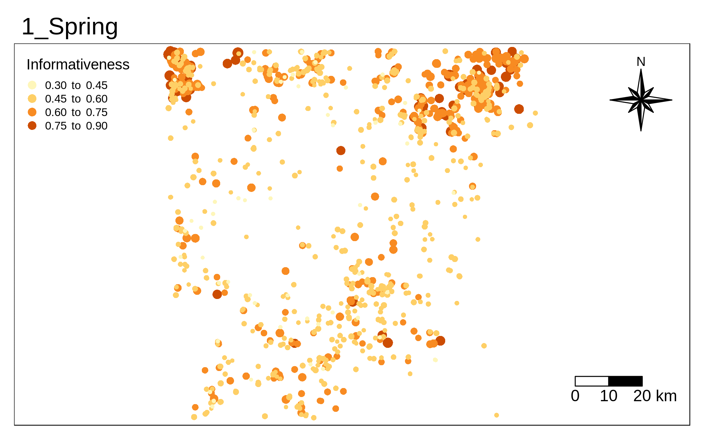
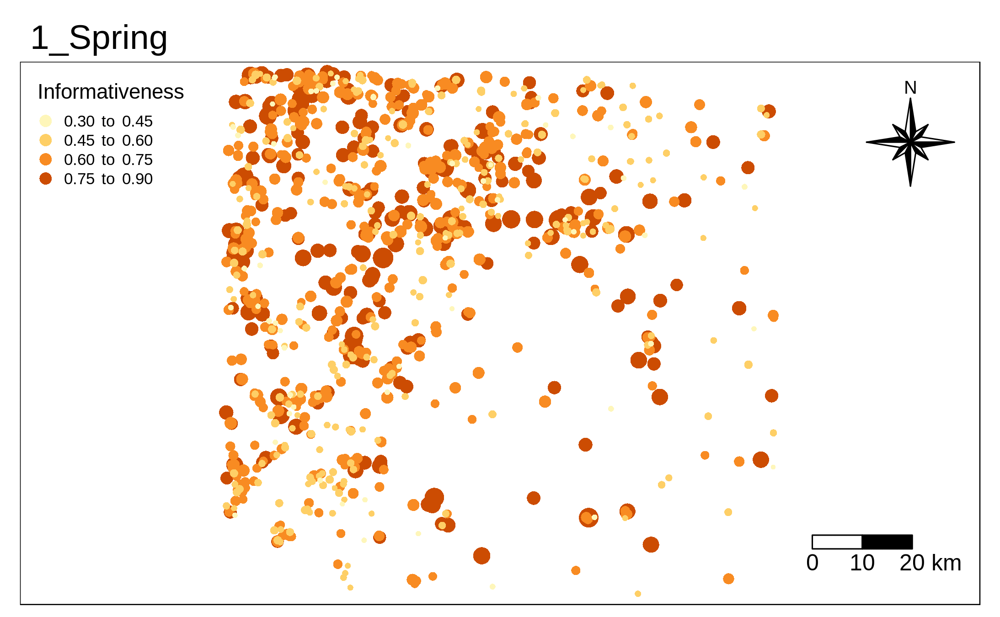
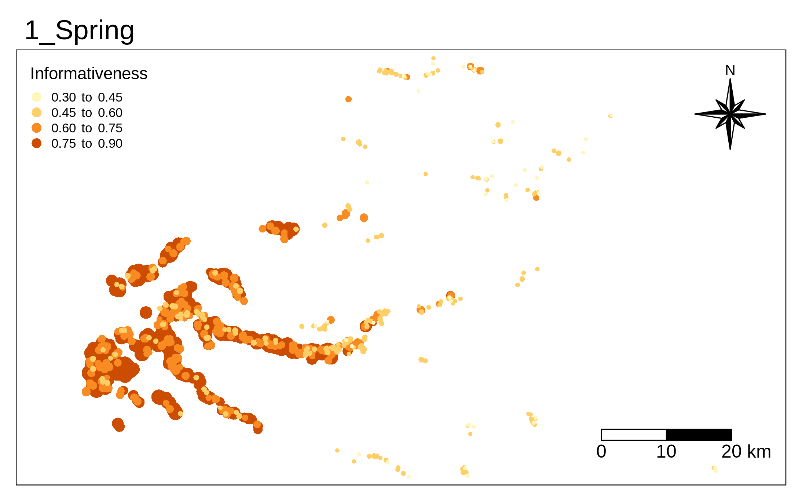

<style>
body {
text-align: justify}
</style>

```{r setup, include=FALSE}
knitr::opts_chunk$set(echo = TRUE)
library(knitr)
library(kableExtra)
```

# Data


## Imagery


```{r , message=FALSE}
library(stars)
library(raster)
folders_path = '/home/user/Documents/TESISMASTER/IMAGES/TO_PROCESS_10m/Prediction/STATIC/IM_20170729'

read_raster = function(x){
  y = raster::raster(paste0(folders_path,"/",x))
  names(y) = "IM"
  return(y)
}
list_raster = lapply(list.files(folders_path)[c(1,4,10,11)],read_raster)
rasters_stack = stack(list_raster)
names(rasters_stack)  = c("BLUE","B05","B8A","NDVI")

#converting to stars object
rasters_stars = st_as_stars(rasters_stack)
plot(rasters_stars)
```

## Composites


## Training data


```{r , message=FALSE, warning= FALSE, message= FALSE}
#importing shapefile
library(sf)
library(tmap)
path_training = '/home/user/Documents/TESISMASTER/VECTOR/Raw_trainingdata/training_samples6.shp'
path_studyarea = '/home/user/Documents/TESISMASTER/VECTOR/CartoBase/StudyArea.shp'

sampling = sf::read_sf(path_training)
study_area = sf::read_sf(path_studyarea)
tmap_mode("view")
map_data <-
  tm_shape(sampling) + 
      tmap::tm_dots('CLASS_NAME') +
  tm_shape(study_area) + 
      tmap::tm_borders(col = "red") +
  tm_layout(basemaps = c('OpenStreetMap'))

map_data

```


# Uncertainty maps


```{r , message=FALSE}
folder_uncertainty = '/home/user/Documents/TESISMASTER/VECTOR/Training_data_composites_max_ndvi_ST_filter_size3'
#calling shapefiles with the uncertainty attribute. This shapefiles are located in different folders depending the date
func_read_shp_uncertainty = function(x){
  path = paste0(folder_uncertainty,"/",x,"/",'training_samples6_rf_w.shp')
  df_shape = sf::read_sf(path)
  df_shape_weights =  df_shape[df_shape$CLASS_NAME == "Rice_fields","weights"]
  df_shape_weights$time = x
  return(df_shape_weights)
}
list_dfshape_uncertainty = lapply(list.files(folder_uncertainty),func_read_shp_uncertainty)

df_uncertainty = do.call("rbind", list_dfshape_uncertainty)
df_uncertainty$size = exp(df_uncertainty$weights*5)*0.01

#shape adminsitrative

path_shape_administrative = '/home/user/Documents/TESISMASTER/VECTOR/CartoBase/Portugal.shp'
shape_administrative = sf::read_sf(path_shape_administrative)

#plot
library(ggplot2)
library(magick)
map_uncertainty <-
  tm_shape(df_uncertainty) +
    tmap::tm_symbols(size = 'size', col = 'weights', shape = 16,
                     breaks = c(seq(0.3, 1, by=0.15)),
                     legend.size.show = FALSE,
                     title.col = "Informativeness", 
                     legend.format = list(text.align="right", text.to.columns = TRUE)) +
  tm_facets(along = "time") +
  tm_compass(type = "8star", position = c("right", "top")) +
  tm_scale_bar(breaks = c(0, 10, 20), size = 1, position = c("right", "bottom"))
#NO RUN  
tmap_animation(map_uncertainty, filename="Uncertainties_Rice_fields.gif", delay=300)
```

## Examples

### Coniferous




### Sealed




## Herbaceous


### Rice fields




```{r , message=FALSE}
library(ggpubr)
library(reshape2)
data_training_descrip = reshape2::melt(table(sampling$CLASS_NAME))
colnames(data_training_descrip) = c("CLass","Number samples")
stable.p <- ggtexttable(data_training_descrip , rows = NULL, 
                        theme = ttheme("mBlue"))
stable.p
```


# Classification over imagery 2017

## Performance of the classification using different methods for sampling data.

On the one hand, as I said before, the proposal is to identify those samples that better fit the need of the imagery, so that, samples that are informative for certain image in certain period can be not informative in another period. At DGT the proposal for selecting the best labels of certain image rely in the mechanism which ndvi work in. For example, non-vegetated class tend to depict near infrared reflectance somehow larger than the red. This slight difference turns out in low positive values of NDVI. This previous knowledge about the behavior of ndvi for certain land cover types led to apply it as measurement to identify possible anomaly data. Therefore, to summarize the methodology, we assume a label corresponds with the ground as long as this match with the usual values of ndvi for that class (centrality) and also range between certain thresholds defined by the literature.

On the other hand, the new methodology proposed here aims at selecting the best labels based on entropies; where Entropy is a function of probabilities and can be considered as an indicator of informativeness. To clarify this methodology, assume that after one classification we have access to the probabilities of classification of certain point that represents in the ground vegetation. During that inspection we see that evidently the classifier selects the class with the highest probability to label the point. However, we are not aware of how certain or uncertain is the classifier labeling that point once we realize that all classes are having more or less the same chance, except for the one the classifier has selected. Under that first evidence the question that can arise is, what happen with this label if we repeat the classification under a different random selection of training and test data?. The optimistic answer may be that the lebel continue being classified as vegetated as it was weakly classified previously and therefore can be considered as a representative label. However, what happen if that is not true?, what happen if after 1000 of iterations the label does not match the class anymore?. Well, under that evidence the label can be considered as low informative since most of the times is wrong classified.

Well, I don't want to dwelt too much time explaining more about the proposed methodologies, for more information, please go directly to the thesis. In this sense, in the following graphic I am comparing, using overall accuracies, two methodologies and two classifiers for the classification of 10 images over the year 2017. That is, the methodology of playing with NDVI, and the methodology of informativeness, under classification using support vector machine and random forest.

The graphic shows the dispersion of the results of overall accuracy using box-plot after implementing 50 classifications per image; under different random selection of test and training set. In the lower part of the graphic in red color, the results for classifications without any preprocessing are shown. This ended up being the worst scenario for the classifications, where the best performance corresponded to one image in July with a median of 0.63. Going upward, in blue color we can see how a preprocessing of the data using central means and NDVI threshold turned out in a better performance in the classification. According with the documentation of analysis of ndvi I took between 15 and 20 % of the samples out per image that were considered unusual in certain time. Moving on, above the blue box-plot we can see the green box-plots with a better performance than the methodology of NDVI. In both scenarios, we have removed practically the same percentage of data and even so, the proposed methodology based on entropies continue being better.

So far I have compared the results of the methodologies using random forest as classifier. However, in violet color, I am showing the performance of support vector machine under the assumption of the second methodology where in all attempts SVM show better results. 

```{r }
#Dates of the images
day_shoot = c("2017/01/15", "2017/04/05", "2017/05/25", "2017/06/14","2017/07/29",
              "2017/08/13","2017/09/12", "2017/10/12", "2017/11/16", "2017/12/16")

path_file = '/home/user/Documents/TESISMASTER/csv/Results/Validation_models/Evaluation_models_A.csv'
#reading file with the final results of classifications
df = read.csv(path_file,sep = ",",header = T)
#CAlling only important models to show
df_models = df[df$Model %in% c("SVM,  85% Informative","RF,  85% Informative","RF, Central means, 80-85% Sampling", "RF,  100% Sampling"),]
#graphic in boxplot form, the idea is to show how stable is the classification per assumption
ggplot(df_models , aes(x=Time, y=OA, fill = Model)) + 
   theme(axis.text.x = element_text(angle = 90, hjust = 1, size= 12),legend.position="bottom", legend.text=element_text(size=10))  +
  geom_boxplot()
```


## Evaluating accuracy per class

The attempt of the previous graphic was to see that the proposed methodology shows better results than previous attempts done at DGT. In that graphic I considered only 85% of the lebels more informative per image. However, I would like to evaluate the performance per class under different scenarios of informativeness of the reference data COS. For this, I brought the image with the best overall accuracy in average, that is July 29. After selecting data per percentage of informativeness, we can see that no all the classes are equally benefited with the reduction of the sampling. For example, the range of overall accuracies after removing data for wetlands is quite shorter compared with the Herbaceous land cover. We may identify here, that some classes are more static than others, and thus, we can see that some classes are more impacted by the fact of no only containing anomaly data, but also, labels that eventually can change to another class for certain time and return to their original state in another time.

Another question that can arise here, is how much data must be out to achieve a good classification and still have unbiased results?. Well this thesis highlight the importance of selecting the most informative data that fit to the need of the image in certain period. However, it is expected that as we start leaving more and more labels less informative out, the accuracy in the classification will increase at some point that the classifier predict perfectly the retained reference data that they consider is pure ( taking out samples with mixture of classes that are also quite important in the classification). In this sense, removing data must be handled carefully since we don't want bias in our results, especially when it come to taking about classifying about 120 million of pixels using 10.000 samples as reference that does not even represent the 0.001% of the data.

For my classification I decided to keep only the 75% of the labels more informative per class.

```{r }
path_file_effectiveness = '/home/user/Documents/TESISMASTER/csv/Results/Validation_models/Evaluation_Informativeness_A.csv'
#reading file with the final results of classifications
df_classes = read.csv(path_file_effectiveness,sep = ",",header = T)
#defining names of the classes
classes_lc = c('Bushes and shrubs', 'Coniferous trees', 'Eucalyptus trees','Herbaceous', 'Holm and Cork Trees', 
            'Non vegetated','Rice fields', 'Sealed', 'Water', 'Wetlands')
df_classes$Class = as.factor(classes_lc[df_classes$Class])
#data frame with the results without filter and date july 29 (best results)
df_classes_wf = df_classes[df_classes$Filter=="F0" & df_classes$Time == "2017-07-29",]
#factors for the percentage
df_classes_wf$Percentage = as.factor(df_classes_wf$Percentage)
#ggplot
ggplot(df_classes_wf, aes(x=Class, y=Accuracy, fill = Percentage)) + 
  theme(axis.text.x = element_text(angle = 90, hjust = 1, size= 12),legend.position="bottom", legend.text=element_text(size=10))  +
  geom_boxplot()
```


## Evaluating performance of classification using spatial filters

After visual inspection of those lees informative samples (see thesis). I was interested in some samples of coniferous trees and Holm and cork trees that in fact were over the class, according with imagery of google earth. However, what it happens is that there are labels that eventually do not overlap precisely the trees, leaving space to be mix with other classes and represent something totally different. Therefore, under this scenario I decided to apply a filter over all the imagery to see if can reduce that noisy and correct problems of geolocation. The filter correspond to a low pass filter and the stat is a median. That is, the median over a window of 3 pixels around. The results are shown in the following graphic, where readers can see how important is for this for the classification.

```{r }
#data frame with the results without filter
df_classes_70 = df_classes[df_classes$Percentage == 70 & df_classes$Time == "2017-07-29", ]
df_classes_70$Class = as.factor(classes_lc[df_classes_70$Class])
#factor model
df_classes_70$Filter = factor(df_classes_70$Filter, levels = c('F0','F3'))

#ggplot
ggplot(df_classes_70, aes(x=Class, y=Accuracy, fill = Filter)) + 
   theme(axis.text.x = element_text(angle = 90, hjust = 1, size= 12),legend.position="bottom", legend.text=element_text(size=10))  +
  geom_boxplot()
```

# Exploring composites

In the same frame of the analysis using only one image for classification. I want to see if besides the treatment over the reference data, the composition of images also can benefit the classification. In this sense, I have compose the imagery for four seasons, using the following imagery:

on description…

## Evaluating Accuracy per class in composites and single imagery


```{r }
#slicing only results for 75% informative sampling for summer 
df_composite_comparision = df_classes[df_classes$Percentage == "70" & df_classes$Filter == 'F3' & df_classes$Time %in%  c("Spring","Summer","Autumn", "Winter"),]
df_composite_comparision$Time = factor(df_composite_comparision$Time , levels = c("Spring","Summer","Autumn", "Winter"))
#grapgic
ggplot(df_composite_comparision , aes(x=Class, y=Accuracy, fill = Time)) + 
   theme(axis.text.x = element_text(angle = 90, hjust = 1, size= 12),legend.position="bottom", legend.text=element_text(size=10)) + 
  geom_boxplot()
```

## Assesment of sample selection in composites and single imagery


```{r }
file_comparision_comp_static =  '/home/user/Documents/TESISMASTER/csv/Results/Validation_models/Evaluation_models_composites.csv'
#reading file
comparision_comp_static = read.csv(file_comparision_comp_static, sep = ',')
#organizing factors
comparision_comp_static$Time = factor(comparision_comp_static$Time, levels = c("2017-04-05","Spring","2017-07-29","Summer","2017-09-12","Autumn","2017-12-16", "Winter"))
#plot
ggplot(comparision_comp_static , aes(x=Time, y=Accuracy, fill = Season)) + 
   theme(axis.text.x = element_text(angle = 90, hjust = 1, size= 12),legend.position="bottom", legend.text=element_text(size=10)) + 
  geom_boxplot()
```

## An interactive map of the classification of summer composite

summer

```{r , message=FALSE, warning= FALSE, message= FALSE}
#importing shapefile
path_tif_summer = '/home/user/Documents/TESISMASTER/IMAGES/TO_PROCESS_10m/Prediction/PREDICTION/COMPOSITES/SUMMER_70AF3.tif'
label_classes = c("Eucalyptus_trees","Herbaceous","Sealed", "Non_vegetated","Rice_fields","Holm_and_Cork_Trees","Coniferous_trees", "Wetlands",
"Water","Bushes_and_shrubs" )
tif_classification_summer = raster::raster(path_tif_summer)
values(tif_classification_summer) = as.factor(values(tif_classification_summer))
pal10 <- c("#33A02C", "#B2DF8A", "#FF0000",  "#FDBF6F", "#999999", "#556E19","#003200" , "#A6CEE3","#1F78B4", "#C133FF")
tmap_mode('view')
map_time <-
  tmap::tm_shape(tif_classification_summer) +
    tmap::tm_raster("SUMMER_70AF3",palette = pal10, labels = label_classes) +
      tmap::tmap_options(max.raster = c(plot = 10e6, view = 10e6)) + 
  tm_layout(basemaps = c('OpenStreetMap',"Esri.WorldImagery"))

map_time 
```


